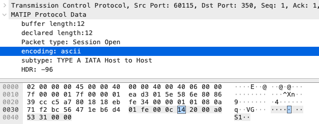
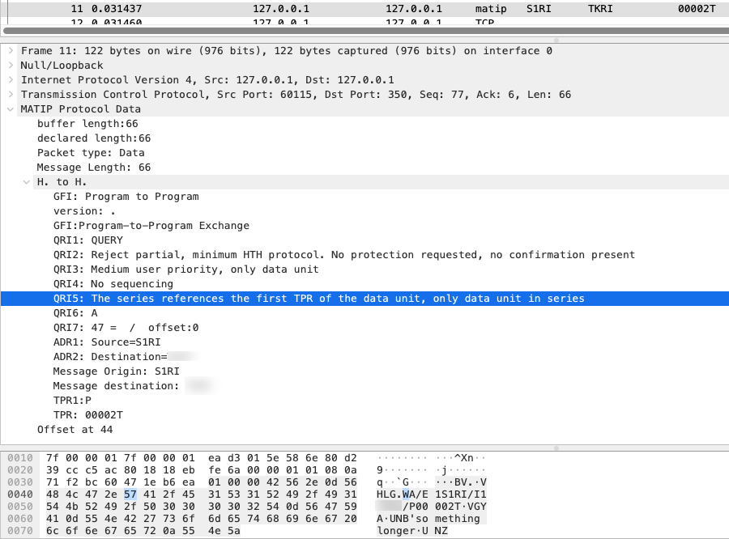

# MATIP and Type A host to host protocol dissector for Wireshark

The goal of the dissector is to reconstruct machine to machine conversation from network packets.

This is a partial implemenation of a protocol dissector for [RFC 2351](https://www.rfc-editor.org/rfc/rfc2351.html) Mapping of Airline Reservation, Ticketing, and Messaging Traffic over IP.

Here's an example for a session opening

It also contains a Host to Host section with elements from [IATA Communication model](https://cdn.document360.io/4b1f93b7-f7b8-4ebb-81be-c17af837a94f/Images/Documentation/Reference%20Communication%20Model.zip)

To use, start `wireshark` with -X lua_script:*<path_to_matip.lua>*

For instance: 
`wireshark -X lua_script:$HOME/Downloads/matip.lua`
